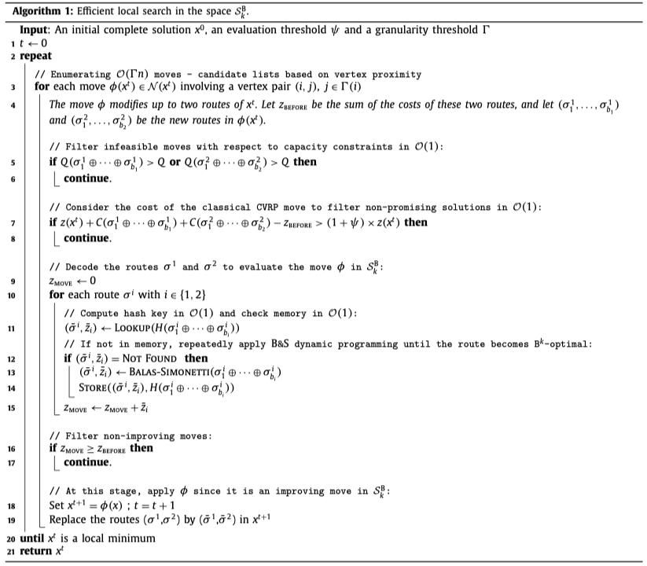
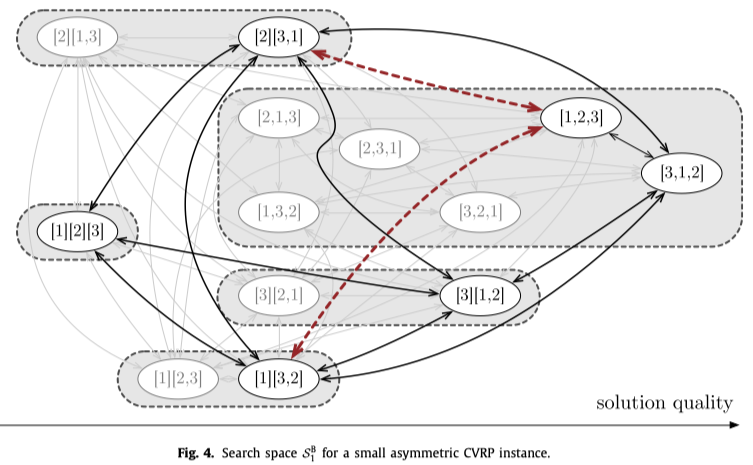

<!--
 * @Author: your name
 * @Date: 2021-01-23 14:38:49
 * @LastEditTime: 2021-01-28 23:53:14
 * @LastEditors: Please set LastEditors
 * @Description: In User Settings Edit
 * @FilePath: /note_md/papers/2019-COR-Toffolo-SeqOrSet.md
-->

# Title

Heuristic for vehicle routing problems: Sequence or set optimization?

## 0. Summary
- 文章研究了cvrp的解空间结构问题，说明了如果能够将决策集结构，缩小搜索空间就可能能够获得质量更好的解。
- 在此基础上，文章首先想到将assignment和sequencing决策集完全分开。首先在将客户划分到哪个路径的客户集合的决策集上进行搜索，获得不完整解；再用tsp求解器对每个路径的客户集合进行tsp问题的求解获得完整解。但是tsp求解器的求解效率不够高，在大算例出现求解不可行的问题。于是作者在完整的搜索空间S和assignment的搜索空间之间进行了平衡，引入了一个$S_k^B$邻域空间，当k=0时就是S搜素空间，当k等于路径长度时就是$S^A$搜索空间，通过B&S算法对前一个求解空间产生的不完整解进行解码获得最终的完整解。
- 文章采用了tunneling技术，使得对$S_k^B$的搜索随着搜索的进行能够接近在S^A中搜索的效果。
- 上述的方法，可以尝试寻找B&S方法的CARP版本，并且将这种方法迁移到TDCARP的变种问题中。
- 在展望中作者提出，当前的方法在计算时间上依然作出了妥协，如果能够在更少的情况下才对$S_k^B$空间搜素，或者通过一个高效的LB对$S^A$得到的不完整解进行过滤，在使用tsp求解器进行进一步的求解
- 什么情况下才搜索空间，是否可以用强化学习来引导？
- 求解器换成LKH会不会更快，如何利用好不完整解的信息

## 1. Research Objective

## 2. Problem Statement

问题陈述，需要解决的问题是什么？

## 3. Method(s)

### 局部搜索
使用到的技术：static neighborhood reductions, dynamic move filters, efficient memory structure, concation techniques.

目的：限制在$S_k^B$搜索空间中的开销，方便的集成到当前的优秀的元启发式算法中。

#### static neighborhood reduction
- 核心思想是将邻域空间缩小到相关的临近节点上。
- 主要使用的依然是常规的邻域算子来缩小搜索空间，包括作用于单个节点或连续的子串的relocation和swap，2-opt，2-opt*。
- 对于每个节点i只考虑和i节点最近的$\Gamma$个节点j，因此邻域空间的大小被限制到了$O(\Gamma n)$

#### dynamic move filter
- 先说move filter的部分，这个部分是通过一个合适的lower bound对大部分move进行粗略的评估和筛选，只留下高置信的move进行精确的评价。
- 对于容量约束，不进行松弛，如果超过约束直接丢弃
- 对$\phi$动作产生的解进行评价获得的成本$z(\phi(\chi^t))$，作为通过B&S decoder优化后的局部最优解的LB。
- 只有当$z(\phi(\chi^t)) \leq (1+\psi) z(\chi^t)$ 时，猜进行进一步的评价
- $\psi$ 是一个重要参数，表示有多少的move能够被评价。同时，定义一个好的$\psi$并不容易，因为它是一个算例相关的变量，考虑到固定的值无法匹配不同大小的算例和属性，文章采用了一种动态的$\psi$计算方式
- 核心思想是通过调整$\psi$使得通过过滤的move的比例保持在目标范围$[ \xi^-,\xi^+]$
- 具体的方法是每进行1000步move评价，测算filter的通过数量$\xi$，如果调出了目标范围，通过一个超参$\alpha$进行调整：
$$
\psi = \begin{cases}
    \psi \times \alpha & \text{if } \xi \lt \xi^-, \\
    \psi / \alpha & \text{if } \xi \gt \xi^+, \\
    \psi & \text{otherwise.}
\end{cases}
$$

#### global memory
- B&S算法的复杂度按照路径长度线性增长，按照k的取值指数增长。因此这个过程的使用需要被严格限制到最小，避免同一个路径被计算两次。
- 具体的做法是通过一个全局内存存储被解码过的路径，避免重复计算。文章使用一个hashtable记录(伪码12-14行)
- 为避免过高的内存占用，文章同时定义了一个$M^{max}$表示最大的存储到hashtable中的路径数量，当达到这个数量时，去除使用频率较小的一半元素。
- 直接去计算hashtable的key事实上已经是O(n)的复杂度，为控制复杂度，文章设计了特别的hash函数用于计算索引

### 常数时间的评价
- 文章采用的依然是和vidal之前的研究一致的将邻域操作建模成子串重连接。
- 和之前类似，对子串进行预处理，预处理计算子串的总需求$Q(\sigma)$，子串的距离$C(\sigma)$，两个hash函数$H^p(\sigma)$和$H^s(\sigma)$
- 对于只含有一个客户i的子串，$Q(\bar{\sigma})=q_i$，$C(\bar{\sigma})=0$,$H^p(\bar{\sigma})=\rho\times i$, $H^s(\bar{\sigma})=\rho^i$，其中$\rho$是质数。
- 对于更长的子串的计算方法如下：

- 给定的两个哈希函数是为了规避不同的子串哈希碰撞，第一个hash函数是一个乘性hash，第二个是一个加性hash，其中用到的$\rho^i$需要提前计算并对一个大数取模防止溢出。
$$
H^p(\sigma)=\sum_{i=1}^{|\sigma|} \rho^i \times \sigma_i \\
H^s(\sigma)=\sum_{i=1}^{|\sigma|} \rho^{\sigma_i}
$$

- 在值的设计上，第一个$\rho$设置的是超过客户数的最小质数，第二个设置为31

### 隧道策略
- tunneling策略解决的问题是两个不同子串具有相同的客户集合，分别进行BS后得到的成本可能不同（例如一个到了最优解，另一个没有到）的问题
- 具体做法：当一个子串没有被hash存储时，首先会被B&S流程进行解码，但并不直接把B&S的结果返回，而是找到目前这个子串所属的客户集合的B&S最优解进行返回
- 如何高效找到这个子串所属集合的当前最优解：使用一个重新定义的基于hash的内存结构，根据他们的访问集合放置到不同的桶中，使用一个额外的hash函数进行O(1)复杂度的查询，具体流程如下

- tunneling策略的优点：在搜索的开始，算法搜索的是$S^B_k$的空间，随着算法的进行，算法越来越频繁的将当前最优解引入到解中，这部分最优解可能是超出$S_k^B$的，因此在一个理想情况下，B&S返回的总是这个子串的TSP最优解，表现出的就像是算法在$S^A$的解空间进行搜索。因此tunneling技术事实上是随着搜索的进行将$S_k^B$空间重映射到了$S^A$搜索空间当中.

几个搜索空间的比较：

> 新的LS过程和例如UHGS中的LS过程的差别主要就在评价过程，是直接计算变动的route的成本还是通过一个hash的结构去查找预处理结果和将结果保存到额外的结构

## 4. Evaluation
- 在LS阶段，按照随机的顺序进行动作评价，并且采用first improve的策略采纳结果
- $\Gamma=20$并且停机条件设置为20000个连续步骤没有提升
- 文章的实验思路，首先对k对不同取值时的LS的性能进行了比较，实际上时测试的LS在$S^A$和$S_k^B$直到S的搜索空间中的搜索效率。其次测试了不同的k值，是否添加move filter以及是否使用tunneling技术情况下的UHGS-BS性能表现，在CVRP的2017年的新算例集上获得了新的SOTA结果
- 在第一步实验中，随着k值的扩大，BS的搜索复杂度也在增大，最终获得的解的质量更高，cpu耗时逐渐变长。事实上，当k大于等于路径基数时，BS解码进行的就是一个TSP的精确求解。通过实验数据，当k从0增长到4时，算法能够获得的性能提升最为显著
- 文章在实验中，将$\xi$的范围设置在了\[90%,95%\]的范围，相比将所有没有提升的move都过滤掉，将gap从0.26%降到了0.21%。并且证实了一个假设：许多在常规的LS方法中抛弃的move，在结合一个路径优化过程后能够产生一个有提升的解。

## 5. Conclusion

- 文章着眼于经典CVRP问题的决策集拆分。更小的搜索空间可以进行更充分的搜索带来更高质量的解。文章表明在assignment($S^A$)空间的搜索相比与在整个搜索空间S进行启发式搜索能够带来更好的解质量。当采用assignment作为搜索空间时，需要将获得的解进行进一步的解码（sequencing）才能能够获得最终的解。但是使用concorde tsp求解器进行直接求解时，在大算例上会带来过长的搜索时间导致不可行。因此文章引入了B&S邻域来在S和$S^A$搜索空间之间进行了平衡，获得了更高的解质量和更快的求解速度。
- 文章在搜素$S_k^B$空间时用到了neighborhood reduce, 动态move filter，子串连接的评价技术，高效的内存结构和tunneling技术。
- 文章对下一步的工作方向提出了以下几点：
  - 如何在没有时间妥协的情况喜爱利用更大的搜索空间，例如$S_k^B$。
  - 一种可能的方式是只在一些高价值的解的子集上才使用$S_k^B$的搜索空间，例如只在每个新产生的最优的不完整解上。
  - 另一种可能是转向$S^A$空间。如果能够结合一个高效的下界计算，排除大部分move，然后采用concorde求解器或者能够更好的利用不完整解的信息的求解器对剩余的解进行评价，也可能获得高质量的解
- 文章提出的这种方法是否可以迁移到其他cvrp的变种问题中，尤其是当变种问题的属性影响到assignment和sequencing决策集的时候
## 6. Notes

(optional) 不符合此框架，但需要额外记录的笔记。

## Reference

(optional) 列出相关性高的文献，以便之后可以继续track下去。
