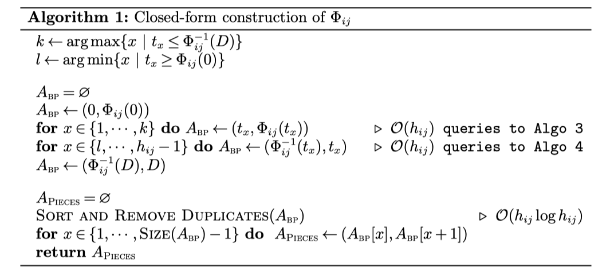
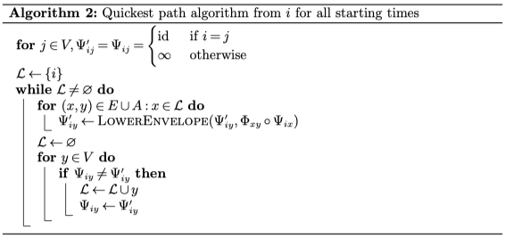
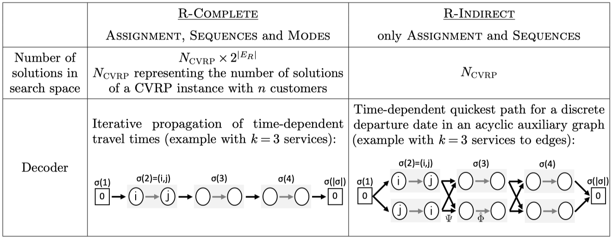

# Title

Arc Routing with Time-Dependent Travel Times and Paths


## 0. Summary

写完笔记之后最后填，概述文章的内容，以后查阅笔记的时候先看这一段。注：写文章summary切记需要通过自己的思考，用自己的语言描述。忌讳直接Ctrl + c原文。


## 1. Research Objective
问题背景
- 现有TDVRP的研究过于简化，Ichoua等的开创性研究针对整个图使用分段常数函数，在这种模型下，事实上两点之间总是有唯一的最短路径
- Rincon，Garcia等提出，不充分的时间相关的行驶时间的管理是当前将算法应用到车辆路径规划软件中的最大障碍

本文目标
- 基于车辆行驶速度的历史数据，定义路网上按照路段的分段行驶速度函数，在ARP中引入时间相关的服务和通行时间函数
- 采用之前文章中的解的表示方法，将模式选择的部分放到解的评价阶段完成
- 给出了基于问题的扰动动作评价下界，用于LS阶段加速
- 针对连续的时间相关的在所有时间出发的最短路径的预处理，能够支持O（1）的通行时间查询


## 2. Problem Statement
给定无向图$G=(V,E,A)$, 节点$0\in V$是唯一的苍点，m辆容量为Q的车辆在0时刻在该点可用。$E_{R} \subseteq E$和$A_R \subseteq A$表示所有有需求的服务点，共有$n=|E_R|+|A_R|$的数量的服务点需要被车辆服务。每个服务点$u\in E_R\cap A_R$具有一个非负需求$q_u$，其中边可用被从两个方向中的一个进行服务，服务的方向称为*模式*，而弧的服务方向是固定的，每个服务的服务模式$M_u$表示该服务的服务方向，因此对于边$M_u=\{1,2\}$,对于弧$M_u=\{1\}$. 每个服务点被服务有且仅有1次，但同一条边可以被通过多次。边和弧上都有一个时间相关的通行和服务速度函数，并且满足FIFO规则（相同的出发和达到点的车辆，先出发的一定比后出发的先到达），TSCARP的目标是设计m条路径使得：
- 每个路径开始和结束于0节点
- 每个服务点被一辆车服务一次
- 每条路径的需求总和不超过单辆车的容量
- 路径的时常不超过最大值D
- 所有路径的总时长最小化

**速度模型**

速度模型总体是符合IGP模型。给定一个规划平面\[0,H\], 每条边或弧$(i,j) \in A_R \cap E_R$具有一个$d_{ij}$, 和一个分段的常数速度函数$v_{ij}:[0,D] \rightarrow \mathbb{R^+}$, 函数具有$h_{ij}$个分段，表示该段关于时间的行驶速度（单位时间的行驶距离）。车辆在该边上行驶的过程中，速度按照该函数随时间变化。在该问题中，边允许具有不对称性，不同的边和弧的方向可以具有不同的速度函数和不同时间点的不连续点。

基于上述的定义，车辆在$t_i$时刻从i出发到达j的通行时间和服务时间$\Phi_{ij}(t_i)$和$\hat{\Phi}_{ij}(t_i)$可以按照下式计算：
$$
\Phi_{ij}(t_i) = \{ x \mid \int_{t_i}^{x}v_{ij}(t) dt=d_{ij}\} \qquad \text{when travelling on (i,j)}\\
\hat{\Phi_{ij}}(t_i) = \{x \mid \int_{t_i}^{x}\hat{v}_{ij}(t) dt=d_{ij}\} \qquad \text{when servicing (i,j)}
$$
对于$t_j$时刻到达j节点的出发时间，可以按照下式计算：
$$
\Phi_{ij}^{-1}(t_i) = \{ x \mid \int_{x}^{t_j}v_{ij}(t) dt=d_{ij}\} \qquad \text{when travelling on (i,j)}\\
\hat{\Phi}_{ij}^{-1}(t_i) = \{x \mid \int_{x}^{t_j}\hat{v}_{ij}(t) dt=d_{ij}\} \qquad \text{when servicing (i,j)}
$$

## 3. Method(s)

### 到达时间函数的计算

定理1: $\Phi_{ij}$是分段线性连续递增函数。

定理2: 令$t_1,\dots,t_{h_{ij}-1}$为函数$v_{ij}$的不连续点，函数$\Phi_{ij}$有最多$2(h_{ij}-1)$的不连续点，其值为$t_1,\dots,t_k,\Phi_{ij}^{-1}(t_i),\dots,\Phi_{ij}^{-1}(h_{ij}-1)$，其中$k=argmax\{x|t_x \leq \Phi_{ij}^{-1}(D)\}以及$l = argmin\{x | t_x \geq \Phi_{ij}(0)\}$。

> 简略证明：令$V_{ij}(x)=\int_{0}^{x}v_{ij}(t)dt$。$V_{ij}(x)$是关于x的严格递增函数，因此反过来$V^{-1}_{ij}$是关于y的严格递增函数，不连续点$(t,V_{ij}(t))$既是V的不连续点也是$V^{-1}$的不连续点。函数$V_{ij}$有不连续点$t_1,\dots,t_k$，则函数$V_{ij}^{-1}$有不连续点$V_{ij}(t_1),\dots,V_{ij}(t_k)$。因为$V_{ij}(\Phi_{ij}(t)) - V_{ij}(t)=d_{ij}$，则有：
> $$\Phi_{ij}(t) = V_{ij}^{-1}(V_{ij}(t) + d_{ij})$$
> $\Phi_{ij}(t)$是两个分段线性函数的组合， 因此也是个分段线性函数，其不连续点为$V_{ij}$和$V_{ij}^{-1}$的不连续点的交集

根据上面的定理，只需要预处理计算出所有的不连续点，以及之间片段的值，可以达到如果已知是第几个片段，以O（1）查询，否则以$O(log h_{ij})$进行二分查询。

文章进一步对查询进行了加速，将规划平面分成了B个桶，将查询先分散到B个桶中，使得同一个桶中的查询复杂度降到O(1)

具体的计算过程如下：


### 最短路径计算的预处理

时间相关的通行时间不能够按照传统的静态图直接处理得到n*n的最小距离矩阵。之前的研究中没有利用预处理，而是在解的求解过程中依赖耗时的最短路径查询。
在这篇文章的研究中，利用预处理计算在所有出发时间t离开起始点j去往每个目的地j的到达时间$\Psi_{ij}(t)$.由于满足FIFO，可以本文使用了dp的方法采用和Bellman-Ford算法相同的方案，用连续的PL函数代替原有的离散值。



作为对比，将Bellman-Ford算法一并列出。
``` cpp
bool Bellman-Ford(G,w,s)        //图G ，边集 函数 w ，s为源点
  for each vertex v ∈ V(G):     //初始化距离源点距离均为无穷大
    d[v] ←+∞
  d[s] ←0                       //源点距离自身为0
  for i = 1 → |V|:              //松弛操作需要重复多次
    for each edge (u,v) ∈ E(G):
      if d[v] > d[u] + w(u,v):
        d[v] = d[u] + w(u,v)
  for each edge(u,v) ∈ E(G):    //判断是否存在负权环路
    if d[v] > d[u] + w(u,v):
      return false
  return true
```

相比Bellman-Ford算法，作出修改的地方主要在，因为$\Psi_{ij}(t)$函数的是连续的表示，原有的离散值的比较变成了下包络线的操作，其中“o”操作表示的是两个PL函数的组合。

在该方法中，包络线操作和组合操作的数量和BF算法一致，保持在$O|V|(|E\Cup A|)$的数量级，函数的线段数最坏达到$O^{\Theta(log n)}$的数量级。

### 分支定价的精确算法


### 混合遗传算法

延续使用UHGS的方法，具有两个关键策略：
- LS阶段间接的解的表示，最终通过确定性的解码算法（dp）获得最优的模式选择
- 高效的下界在O（1）时间复杂度筛选非置信的移动

在该问题中应用HGS的主要改动包括：
- 替换解的解码器
- 替换lb的计算
- 保持相同的解的表示和搜索算子


**解码器**

TDCARP组合了四类决策：分配服务到车辆，一条路径中的服务顺序，服务的模式选择，服务之间的路径选择

在本文中，解的表示采用和Vidal2017中一样的，一个不包含模式信息的服务的序列，用dp的方法完成模式选择，如下图中的R-Indirect



在时间相关的通行时间的问题中，解的评价需要到达时间和完成服务时间在整个辅助图中传播。在本文中，这种传播通过Bellman算法，同时使用到的预处理中计算的最短路径$\Psi$的信息，来评估服务之间的通行时间和服务的服务时间。
对于R-Indirect中的一条路径$\sigma=(\sigma(1),\dots,\sigma(|\sigma|))$,其中$\sigma(1)=0,\sigma(|\sigma|) = 0$表示仓点的起点和终点，每个服务$\sigma(i)$的每种模式$l \in M_{\sigma(i)}$的完成时间$T_{\sigma(i)}^{EXACT}[l]$可以按照下式计算：
$$
T_{\sigma(i)}^{EXACT}[l]=
\begin{cases}
  0, & \text{if i = 1}\\
  min_{k \in M_{\sigma(i-1)}} \{\hat{\Phi}^l_{\sigma(i)} (\Psi_{\sigma(i-1)\sigma(i)}^{kl}(T_{\sigma(i-1)}^{EXACT}[k]))\}, & \text{otherwise} 
\end{cases}
$$

整条路径的最终时长为$T_{\sigma(|\sigma|)}^{EXACT}[1]$

在上式中，
- $\Psi_{ij}^{kl}(t)$表示按照k模式服务完i服务从终点出发按照l模式服务j的情况下的到达时间
- $\hat{\Phi}^l_{i}(t)$表示从t时间开始以l模式服务i服务的完成时间

令$C_{\Psi}$和$C_{\hat{\Phi}}$表示函数$\Psi$和函数$\hat{\Phi}$的查询复杂度，对于R-Indirect方法，复杂度是$4kC_{\Psi}+4kC_{\hat{\Phi}}$


**邻域搜索的加速**

- 采用首次提升策略，随机的在邻域进行搜索，在第一次提升时采纳
- 该问题的LS中的两点性质：
  - 所有的邻域操作都是将最多两个路径分成固定数量的子串并重新连接。对这些子串的预处理信息能够减少路径连接的评价的复杂度
  - 令$C_{LB}(\sigma)$表示一个路径$\sigma$的下界， 令$\Pi$表示一个将一对路径$(\sigma_1,\sigma_2)$转换成$(\sigma_1', \sigma_2')$的邻域动作。如果$C_{LB}(\sigma_1') +C_{LB}(\sigma_2') - C(\sigma_1) - C(\sigma_2) \geq 0$, 则$\Pi$认为是没有提升的应该被过滤掉

下界的估算

$T^{LB}(\sigma)[k,l]$表示一个连续的访问$\sigma$,在第一个服务以k模式服务，最后一个服务以l模式服务，按照各种服务模式组合的下界。
对于含有一个服务i的序列$\sigma$，有：
$$
T^{LB}(\sigma)[k,l]=
\begin{cases}
  min_{t \in [0,D]} \{\hat{\Phi}^k_i(t) - t\} & \text{if k = l} \\
  \infin & \text{ohterwise}
\end{cases}
$$

其中$min_{t \in [0,D]} \{\hat{\Phi}^k_i(t) - t\}$表示以k模式服务i服务的最小时间。对于$\sigma_1 \oplus\sigma_2$表示的两个序列的连接，其下界可以按照下式估计：
$$
T^{LB}(\sigma_1\oplus \sigma_2)[k,l] = min _{x,y}\big \{ T^{LB}(\sigma_1)[k,x] + min_{t \in [0,D]} \{\Psi_{\sigma(|\sigma_1|)\sigma_2(1)}(t) - t\} + T^{LB}(\sigma_2)[y,l] \big \}
$$

最后，文章提出了一种更加强化的下界，在知道第一段子串的确切到达时间时，新的下界可以表示为
$$
T^{LB+}(\sigma_1\oplus\dots\oplus\sigma_S) = min_{x,y} \big \{ \Psi_{\sigma_1(|\sigma_1|)\sigma_2(1)} (T_{\sigma_1(|\sigma_1|)}^{EXACT}[x]) + T^{LB}(\sigma_2\oplus\dots\oplus\sigma_S)[y,1] \big \}
$$

文章的数据给出这样的下界能够过滤91%的邻域操作 

## 4. Evaluation

作者如何评估自己的方法，实验的setup是什么样的，有没有问题或者可以借鉴的地方。


## 5. Conclusion

作者给了哪些结论，哪些是strong conclusions, 哪些又是weak的conclusions?


## 6. Notes

- 关键点依然在通过一些精确算法（DP等）缩小了启发式算法的搜索空间。


## Reference

(optional) 列出相关性高的文献，以便之后可以继续track下去。